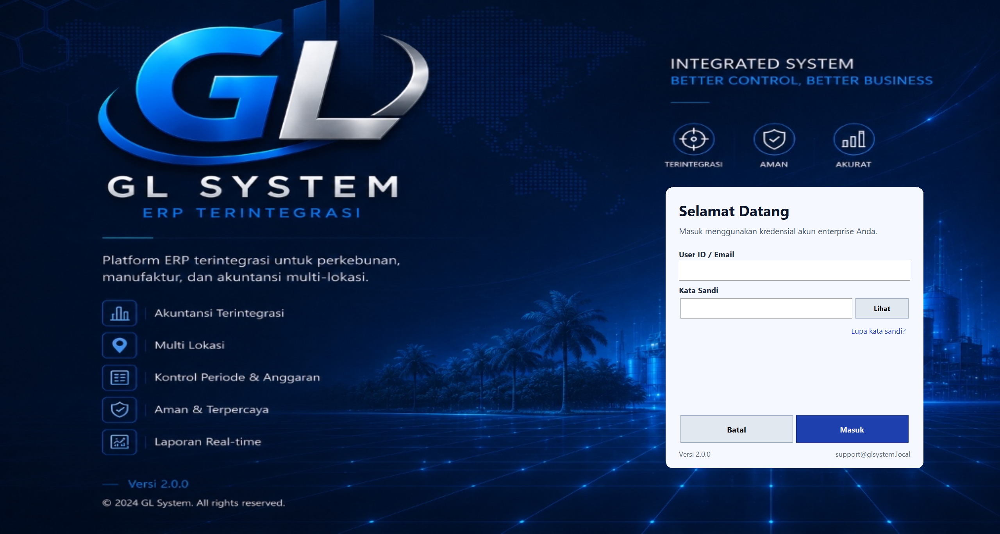
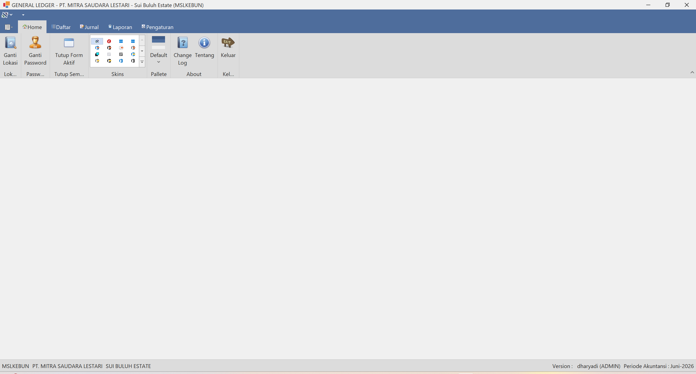

# KSK Accounting

KSK Accounting adalah aplikasi desktop Accounting / General Ledger berbasis .NET 8 Windows Forms. Aplikasi ini berfokus pada pencatatan jurnal, chart of accounts, import/export data, RBAC user access, migrasi database Oracle, serta modul Fixed Asset.

## Tampilan Aplikasi

### Halaman Login



### Tampilan Utama (General Ledger)



## Fitur Utama

- General Ledger dan input jurnal
- Daftar dan pencarian jurnal
- Import jurnal parsial dan integrasi dari modul lain
- Export jurnal dan laporan ke format spreadsheet
- Master data akun, lokasi, blok, divisi, periode, company profile, dan user
- Role Based Access Control untuk menu dan aksi aplikasi
- Login security hardening dengan PBKDF2-HMAC-SHA256, 600.000 iterasi, salt acak 16 byte, dan migrasi hash lama saat login
- Audit trail untuk aktivitas penting
- Fixed Asset:
  - master asset
  - CIP
  - depreciation preview dan posting
  - lifecycle transaction
  - approval, posting, reversal
  - laporan fixed asset
- Oracle SQL migrator untuk deployment perubahan database
- Unit test untuk autentikasi, password migration, dan pembulatan nilai jurnal

## Teknologi

- .NET 8
- Windows Forms
- C#
- Oracle Managed Data Access
- Dapper
- DevExpress WinForms 24.1
- EPPlus
- ExcelDataReader
- Serilog
- xUnit

## Struktur Repository

```text
.
├── Accounting/                         # Aplikasi utama WinForms
│   ├── 1.Interface/                    # Kontrak repository/service
│   ├── 2.DataAcces/                    # Data access dan repository
│   ├── 3.Services/                     # Business services
│   ├── DataLayer/                      # Repository legacy dan akses data
│   ├── DatabaseScripts/                # Script database pendukung
│   ├── FixedAssets/                    # Modul fixed asset
│   ├── Form/                           # Form UI WinForms
│   ├── Models/                         # DTO dan model aplikasi
│   ├── Services/                       # Authentication, authorization, session
│   ├── UC/                             # User controls
│   └── Utilities/                      # Config, connection, migrator, helper
├── Accounting.Tests/                   # Unit tests
└── bgnewgl.png                         # Asset visual aplikasi
```

## Prasyarat

- Windows
- Visual Studio 2022 atau .NET SDK 8
- Oracle database
- Akses package NuGet
- DevExpress WinForms 24.1 yang sesuai dengan lisensi project
- SQL*Plus tersedia di `PATH` jika menjalankan `GLMigrator.exe`

## Konfigurasi

Konfigurasi koneksi database berada di:

```text
Accounting/Utilities/config.json
```

Pastikan nilai server, service name, user, password, dan active server key sesuai dengan environment yang digunakan.

> Jangan commit credential production ke repository publik. Gunakan konfigurasi environment atau file config lokal untuk deployment.

## Build

Dari root repository:

```powershell
dotnet restore .\Accounting\GL_MVC_Repository.sln
dotnet build .\Accounting\GL_MVC_Repository.sln
```

Untuk menjalankan aplikasi dari CLI:

```powershell
dotnet run --project .\Accounting\Accounting.csproj
```

Atau buka solution berikut menggunakan Visual Studio:

```text
Accounting/GL_MVC_Repository.sln
```

## Test

```powershell
dotnet test .\Accounting.Tests\Accounting.Tests.csproj
```

## Database Migration

Repository ini menyediakan GL Migrator untuk menjalankan perubahan schema Oracle.

Lokasi migrator:

```text
Accounting/Utilities/Sql/GLMigrator
```

Contoh penggunaan:

```powershell
.\Accounting\Utilities\Sql\GLMigrator\dist-exe\<package>\GLMigrator.exe --mode status
.\Accounting\Utilities\Sql\GLMigrator\dist-exe\<package>\GLMigrator.exe --mode up
.\Accounting\Utilities\Sql\GLMigrator\dist-exe\<package>\GLMigrator.exe --mode verify
```

Build package migrator:

```powershell
powershell -ExecutionPolicy Bypass -File .\Accounting\Utilities\Sql\GLMigrator\Build-GLMigratorExePackage.ps1
```

Detail lebih lengkap tersedia di:

- `Accounting/Utilities/Sql/GLMigrator/README.md`
- `Accounting/FixedAssets/README.md`

## Modul Fixed Asset

Modul Fixed Asset memiliki struktur layer:

- `Accounting/FixedAssets/Domain`
- `Accounting/FixedAssets/Application`
- `Accounting/FixedAssets/Infrastructure`
- service entrypoint di `Accounting/3.Services`
- UI di `Accounting/Form`

Fitur utama Fixed Asset meliputi master asset, CIP, depreciation, lifecycle transaction, approval, posting ke GL, reversal, audit log, dan laporan.

## Catatan Development

- Target framework utama adalah `net8.0-windows`.
- Aplikasi menggunakan Windows Forms, sehingga build dan run normalnya dilakukan di Windows.
- Beberapa file output build dan package migrator dapat berukuran besar. Pastikan file generated/binary yang tidak diperlukan sudah masuk `.gitignore` sebelum push ke repository publik.
- Gunakan migrasi database secara bertahap dan verifikasi hasilnya sebelum deployment ke production.

## Lisensi

Repository ini digunakan untuk kebutuhan internal KSK Group. Distribusi, akses, dan penggunaan mengikuti kebijakan internal pemilik repository.
