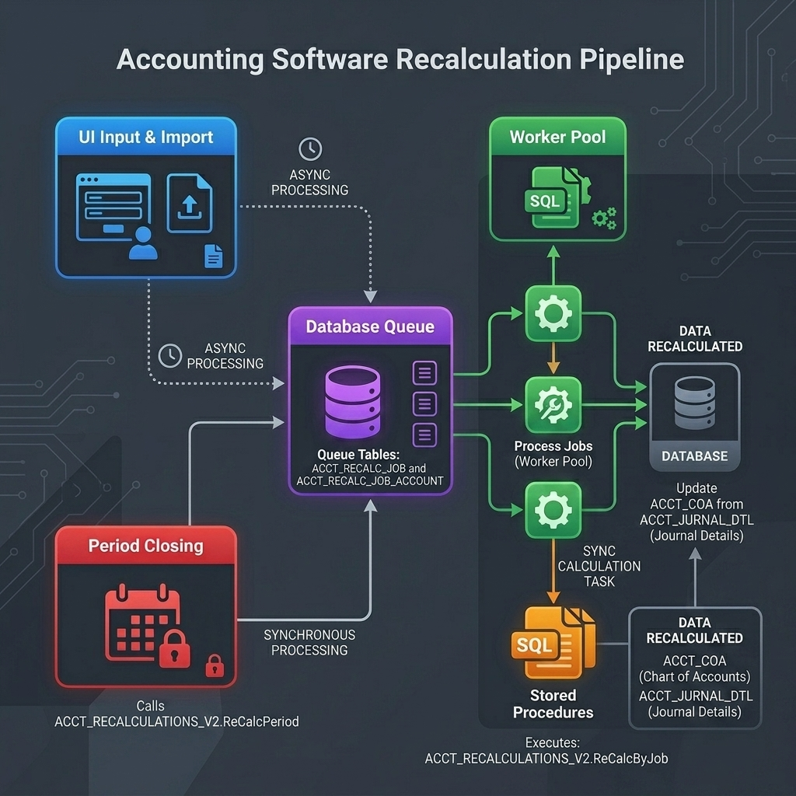
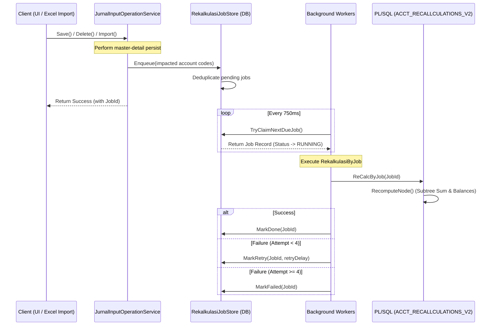

# Recalculation (Recalc) Pipeline: Flow, Code & Gap Analysis

This document provides a comprehensive architectural and code review of the new asynchronous recalculation (recalc) pipeline implemented in [kskaccounting](file:///D:/VSCODE/Project/GL_MVC_Repository). 

---

## 1. Flow Overview

Berikut adalah diagram alur visual dari sistem rekalkulasi:



### Alur Detail (Mermaid Diagram)



---

## 2. Detailed Code Review

### A. Queue Mechanism: [RekalkulasiJobStore.cs](file:///D:/VSCODE/Project/GL_MVC_Repository/Accounting/3.Services/RekalkulasiJobStore.cs)
* **Deduplication**: In [Enqueue](file:///D:/VSCODE/Project/GL_MVC_Repository/Accounting/3.Services/RekalkulasiJobStore.cs#L47-L141), before inserting a new job, it queries for any existing `PENDING`, `RETRY`, or `RUNNING` jobs for the same `(IDDATA, PERIODE, JURNALID)`. If found, it merges the newly-impacted accounts into [ACCT_RECALC_JOB_ACCOUNT](file:///D:/VSCODE/Project/GL_MVC_Repository/Accounting/3.Services/RekalkulasiJobStore.cs#L157-L171) without spawning a duplicate job. This is a highly efficient deduplication pattern.
* **Batch Fetching**: In [TryClaimNextDueJob](file:///D:/VSCODE/Project/GL_MVC_Repository/Accounting/3.Services/RekalkulasiJobStore.cs#L173-L280), candidates are fetched in batches of 8, and the worker attempts to claim them one-by-one by updating their status to `RUNNING`.

### B. Worker Pool: [JurnalInputOperationService.cs](file:///D:/VSCODE/Project/GL_MVC_Repository/Accounting/3.Services/JurnalInputOperationService.cs)
* **Thread Control**: Workers are initiated statically via `EnsureRekalkulasiWorkersStarted`. The worker count is configurable through the `ACCOUNTING_RECALC_WORKERS` environment variable (default: 2, max: 8).
* **Retry Backoff Schedule**: Failed jobs use an exponential backoff schedule `[1m, 5m, 15m]` with a maximum of 4 attempts before permanently failing.
* **Health Monitoring**: [RekalkulasiHealthMonitorLoop](file:///D:/VSCODE/Project/GL_MVC_Repository/Accounting/3.Services/JurnalInputOperationService.cs#L642-L670) periodically logs system health metrics and triggers [RecoverStaleRunningJobs](file:///D:/VSCODE/Project/GL_MVC_Repository/Accounting/3.Services/JurnalInputOperationService.cs#L672-L691) to recover jobs that are stuck in the `RUNNING` state due to application crashes or worker interruptions.

### C. Stored Procedure: [V20260626_005__recalc_v2_period_entrypoint.sql](file:///D:/VSCODE/Project/GL_MVC_Repository/Accounting/Utilities/Sql/GLMigrator/migrations/V20260626_005__recalc_v2_period_entrypoint.sql)
* **Idempotency**: The new `ACCT_RECALLCULATIONS_V2` package calculates mutations as absolute sums from `ACCT_JURNAL_DTL` rather than using additive increments (`+=`). This prevents compounding errors during retries or race conditions.
* **ReCalcPeriod**: Standardized period recomputation uses a single `MERGE` query ([RecomputePeriodMutasi](file:///D:/VSCODE/Project/GL_MVC_Repository/Accounting/Utilities/Sql/GLMigrator/migrations/V20260626_005__recalc_v2_period_entrypoint.sql#L210-L712)) and a dynamic set-based balance update ([RecomputePeriodSaldo](file:///D:/VSCODE/Project/GL_MVC_Repository/Accounting/Utilities/Sql/GLMigrator/migrations/V20260626_005__recalc_v2_period_entrypoint.sql#L714-L756)). This is extremely performant and skips row-by-row cursors.

---

## 3. Identified Gaps & Concurrency Risks

During the review, five major gaps/risks were identified:

### Gap 1: Row Locking Contention in Worker Queue
In [TryClaimNextDueJob](file:///D:/VSCODE/Project/GL_MVC_Repository/Accounting/3.Services/RekalkulasiJobStore.cs#L173-L280), candidate jobs are selected using a standard select query:
```sql
SELECT JOB_ID FROM (
    SELECT JOB_ID FROM ACCT_RECALC_JOB
    WHERE STATUS IN ('PENDING', 'RETRY') AND (NEXT_RETRY_AT IS NULL OR NEXT_RETRY_AT <= SYSTIMESTAMP)
    ORDER BY CREATED_DATE, JOB_ID
) WHERE ROWNUM <= :candidateLimit
```
* **Risk**: When multiple workers run concurrently, they will both select the exact same candidate list. The first worker to run `UPDATE ACCT_RECALC_JOB SET STATUS = 'RUNNING' WHERE JOB_ID = :jobId` will lock that row. The second worker will **block** on that update statement until the first worker commits its transaction. Once committed, the second worker's update will fail to match (`STATUS IN ('PENDING', 'RETRY')` is no longer true) and return `affectedRows = 0`.
* **Impact**: Redundant block times and thread contention under load.
* **Remedy**: Use Oracle's `FOR UPDATE SKIP LOCKED` inside the candidate selection subquery to fetch and lock candidate rows without blocking other worker threads.

### Gap 2: Deadlocks & Overwrite Races on Same `IDDATA`
Since workers are independent threads, they pull jobs from the queue without checking if another worker is already processing a job for the same `IDDATA` (estate/company) and `PERIODE`.
* **Risk**: If two jobs for `IDDATA = 'ESTATE01'` and `PERIODE = '05/2026'` are running concurrently on Worker 1 and Worker 2:
  1. Both will execute `ReCalcByJob`.
  2. Both will try to update overlapping ancestor accounts (like parent summary accounts `10000`, `11000`).
  3. Depending on the order of updates, they can easily cause a **database deadlock** (`ORA-00060: deadlock detected`).
  4. Even if they don't deadlock, they will lock each other out, causing timeouts, and overwrite each other's calculations.
* **Impact**: High failure rates, slow performance, and potential concurrency warnings in log files.
* **Remedy**: Introduce a serialization mechanism (e.g., an application lock using `DBMS_LOCK.REQUEST` in PL/SQL, or a queue-based restriction in `TryClaimNextDueJob` that prevents claiming jobs for an `IDDATA` that is currently in a `RUNNING` status).

### Gap 3: Missing Transaction Atomicity in Worker Execution
In [RekalkulasiWorkerLoop](file:///D:/VSCODE/Project/GL_MVC_Repository/Accounting/3.Services/JurnalInputOperationService.cs#L553-L640), the worker executes the stored procedure:
```csharp
AccountServices.RekalkulasiByJob(job.IdData, job.GlMonth, job.GlYear, job.Periode, job.UserId, job.JobId, job.JurnalId);
```
* **Risk**: The stored procedure does not open an explicit database transaction and has no `COMMIT` or `ROLLBACK` blocks. If the recalculation fails halfway (e.g., due to a network interruption or database constraint), the database will contain **partially recalculated accounts** (some ancestor balances will be updated, others will not).
* **Impact**: Until the job successfully retries and finishes, reports or trial balances will display corrupted and inconsistent data.
* **Remedy**: Wrap the execution of `AccountServices.RekalkulasiByJob` in a local `OracleTransaction` in C# (or add `SAVEPOINT` and rollback blocks in PL/SQL) to ensure that the entire recalculation is applied atomically.

### Gap 4: Aggressive Stale Recovery Threshold
The stale threshold defaults to 180 seconds (3 minutes) in [ResolveRekalkulasiRunningStaleThreshold](file:///D:/VSCODE/Project/GL_MVC_Repository/Accounting/3.Services/JurnalInputOperationService.cs#L722-L733).
* **Risk**: Under peak database load, or during large historical imports, a recalculation or lock-wait state could take more than 3 minutes.
* **Impact**: If a job takes 3.5 minutes, the health monitor will mark it as `RETRY` (putting it back in the queue) while the original worker is still executing it. A second worker will then claim and execute the same job, leading to severe lock conflicts and duplicate calculations.
* **Remedy**: Increase the default stale threshold to at least **15 minutes** (`900` seconds) or introduce a worker heartbeat mechanism that periodically updates `UPDATED_DATE` of running jobs.

### Gap 5: Row-by-Row Subtree Sum Bottleneck in `ReCalcByJob`
Currently, `ReCalcByJob` loops over each leaf and ancestor account node and runs `RecomputeNode` (which performs a hierarchical query `START WITH CONNECT BY` and updates that node).
* **Risk**: If 50 accounts are impacted, `ReCalcByJob` runs 50 separate SQL updates and 50 hierarchical selects.
* **Impact**: Unnecessary CPU utilization on the Oracle database server.
* **Remedy**: Re-write `ReCalcByJob` to use a single set-based `MERGE` query targeting only the subtrees of the impacted accounts, similar to the logic used in `RecomputePeriodMutasi`.

---

## 4. Recommended Action Plan

### Step 1: Implement `SKIP LOCKED` in Queue Claim
Modify [TryClaimNextDueJob](file:///D:/VSCODE/Project/GL_MVC_Repository/Accounting/3.Services/RekalkulasiJobStore.cs#L180-L188) query to skip locked rows:
```sql
SELECT JOB_ID
FROM (
    SELECT JOB_ID
    FROM ACCT_RECALC_JOB
    WHERE STATUS IN ('PENDING', 'RETRY')
      AND (NEXT_RETRY_AT IS NULL OR NEXT_RETRY_AT <= SYSTIMESTAMP)
    ORDER BY CREATED_DATE, JOB_ID
)
WHERE ROWNUM <= :candidateLimit
FOR UPDATE SKIP LOCKED
```

### Step 2: Add Transaction in Worker Loop
Update [RekalkulasiWorkerLoop](file:///D:/VSCODE/Project/GL_MVC_Repository/Accounting/3.Services/JurnalInputOperationService.cs#L590-L611) to wrap the execution inside an ADO.NET transaction:
```csharp
using (var workerConn = new OracleConnection(LoginInfo.OracleConnString))
{
    workerConn.Open();
    using (var workerTrans = workerConn.BeginTransaction())
    {
        try
        {
            // Execute the recalc SP on workerConn with workerTrans...
            workerTrans.Commit();
        }
        catch
        {
            workerTrans.Rollback();
            throw;
        }
    }
}
```

### Step 3: Increase Stale Threshold Default
In [JurnalInputOperationService.cs](file:///D:/VSCODE/Project/GL_MVC_Repository/Accounting/3.Services/JurnalInputOperationService.cs#L724), update the default stale threshold to `900` (15 minutes).

---

## 5. Referensi Tabel & Stored Procedure Terkait

Berikut adalah daftar tabel database dan stored procedure yang terlibat dalam proses rekalkulasi (*recalc*):

### A. Tabel Database (Oracle)
1. **`ACCT_RECALC_JOB`**: Tabel utama yang menyimpan antrean (*queue*) job rekalkulasi.
   * *Kolom penting*: `JOB_ID` (PK), `IDDATA`, `PERIODE`, `STATUS` (`PENDING`, `RUNNING`, `RETRY`, `DONE`, `FAILED`), `ATTEMPT_COUNT`, `NEXT_RETRY_AT`, `LAST_ERROR`, `CREATED_DATE`, `UPDATED_DATE`.
2. **`ACCT_RECALC_JOB_ACCOUNT`**: Menyimpan daftar kode akun COA yang terdampak oleh setiap job.
   * *Kolom penting*: `JOB_ID` (FK), `KODEACC`.
3. **`ACCT_COA`**: Menyimpan Chart of Accounts (COA) beserta nilai saldo dan mutasi bulanan.
   * *Kolom penting*: `KODEACC`, `PARENTACC`, `POSISI` (`D`/`K`), `SALDOAWAL`, kolom mutasi bulanan (`1D`, `1K` s.d. `12D`, `12K`), dan kolom saldo bulanan (`1S` s.d. `12S`).
4. **`ACCT_JURNAL_DTL`**: Menyimpan detail baris transaksi jurnal. Tabel ini digunakan sebagai sumber data tunggal (*source of truth*) untuk menghitung mutasi COA.
5. **`ACCT_DEFAULT`**: Menyimpan akun default (seperti default akun inventori/barang dalam perjalanan).

### B. Package & Stored Procedure (Oracle PL/SQL)
Semua prosedur rekalkulasi baru berada di dalam package **`ACCT_RECALLCULATIONS_V2`**:
1. **`ReCalcByJob`**: 
   * *Fungsi*: Menghitung ulang akun yang terpengaruh berdasarkan daftar di `ACCT_RECALC_JOB_ACCOUNT` untuk `p_JOBID` tertentu. Digunakan oleh worker latar belakang secara asinkron.
2. **`ReCalcByJurnalID`**: 
   * *Fungsi*: Menghitung ulang akun secara asinkron berdasarkan entri transaksi dari `p_JURNALID` tertentu yang masih aktif di detail jurnal.
3. **`ReCalcPeriod`**: 
   * *Fungsi*: Menghitung ulang mutasi dan saldo satu periode penuh secara sinkron saat proses tutup buku bulanan.
4. **`RecomputeNode`** *(Internal)*: 
   * *Fungsi*: Menghitung ulang mutasi satu kode akun beserta seluruh cabang anaknya (*sub-tree*).
5. **`RecomputePeriodMutasi`** *(Internal)*: 
   * *Fungsi*: Melakukan sinkronisasi mutasi bulanan seluruh akun COA secara efisien menggunakan perintah `MERGE` (*set-based*).
6. **`RecomputePeriodSaldo`** *(Internal)*: 
   * *Fungsi*: Menghitung saldo akhir bulanan dan menggulirkannya (*roll-forward*) hingga Desember menggunakan satu perintah `UPDATE` massal.
7. **`ACCT_RECALLCULATIONS.UpdSaldoAkhir_sd_Des_byKODE`** *(Legacy)*:
   * *Fungsi*: Menggulirkan saldo akhir akun tertentu dari bulan berjalan sampai Desember. Dipanggil oleh `RecomputeNode`.
